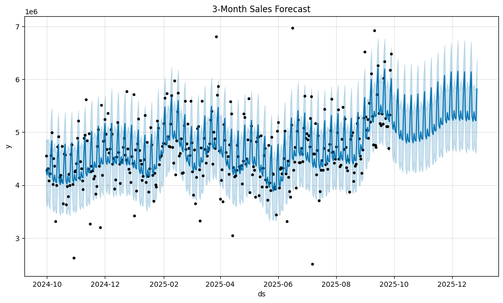

# 📈 Time Series Forecasting Project

## 📘 Overview
This project focuses on **time series forecasting**, aiming to predict future values based on historical data using statistical and machine learning models.

## 🧠 Methodology
The notebook explores data preprocessing, visualization, model training, and forecasting. Typical models include:
- ARIMA / SARIMA
- Prophet
- LSTM / RNN-based models
- Moving averages and smoothing methods

## 📊 Visualizations
Below are visualizations generated from the notebook:





## 🧾 Notebook Summary
*(Notebook markdown content will appear here once extracted.)*

## ⚙️ How to Run
1. Install dependencies:
   ```bash
   pip install -r requirements.txt
   ```
2. Run the notebook:
   ```bash
   jupyter notebook timeseies_forecast.ipynb
   ```
3. Export plots as `.png` files in the same directory to display them here.

## 📈 Results
Summarize key findings such as model accuracy (MAE, RMSE) and forecast trends.

## 📚 References
- Hyndman, R.J. & Athanasopoulos, G. *Forecasting: Principles and Practice*.
- TensorFlow & Scikit-learn documentation.

---
*Generated automatically from the project notebook.*
